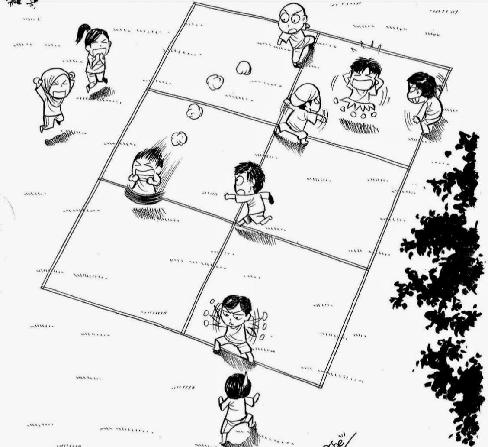

# WEAVE



## Game brief

**WEAVE** is a procedural 2D top-down arcade survival and score-attack game inspired by the traditional Malaysian game **Galah Panjang**.

The player starts in Safe A, crosses a guarded court to reach Safe B, and must return to Safe A to complete the round. Defenders are restricted to the generated longitudinal and transverse court lines, but they track the player, sprint when an interception is possible, lose stamina, become exhausted, and collide with one another. Each completed round increases the score and raises the difficulty. The run ends when a defender catches the player outside a safe zone.

### Malaysia Day connection

Malaysia Day commemorates the formation of Malaysia on 16 September 1963. I wanted the game to celebrate Malaysian identity through something social and familiar: a traditional childhood game.

Galah Panjang provided the foundation:

- Its divided court became the procedurally generated playfield.
- Its guards became line-bound defenders.
- Its runners' goal became the journey from Safe A to Safe B and back.
- Its emphasis on timing, feints, and finding an opening became the central player skill.

Rather than reproducing every rule literally, WEAVE translates Galah Panjang into a fast single-player arcade format while keeping its recognisable court, crossing objective, and defender roles.

## Genre

**2D top-down arcade survival / endless score attack with procedural courts.**

The procedural layouts and run restarts add variety, but the focus is immediate movement, evasion, stamina management, and high-score chasing.

## Controls

| Input | Action |
|---|---|
| `WASD` or arrow keys | Move |
| Left or right `Shift` while moving | Sprint |
| `Enter` on the game-over screen | Start another run |
| Window close request or `Escape` | Exit |

Diagonal movement is normalized so it is not faster than horizontal or vertical movement. Sprinting drains stamina. At zero stamina, the player moves more slowly until stamina recovers to half-full. Safe A and Safe B protect the player whenever the player's center is inside them.

## Build and run

### Dependencies

| Dependency | Version or requirement | Purpose |
|---|---|---|
| C++ | C++17 | Game and engine code |
| raylib | `6.1-dev`, vendored Git submodule at commit `b98c4e031d3a7c6fab4d62182924489f9e8b7cab` | Window, input, timing, render textures, shapes, and text |
| OpenGL | 3.3-capable driver/context | Graphics backend used by the raylib desktop build |
| GNU Make and POSIX shell | GNU-compatible | Build recipes |
| GCC and binutils | `c++`, `gcc`, and `ar` available | Compile the C++ game and vendored raylib C source |
| X11 or XWayland | Development headers and libraries | Linux windowing |

raylib is included through `vendor/raylib`, so it does not need to be installed separately. The Git submodule must be downloaded.

The supplied `Makefile` targets Linux/X11. On Windows, build inside WSL2 and run through WSLg or another working X server. No native PowerShell, Windows, or macOS build target is supplied.

On Debian or Ubuntu:

```sh
sudo apt update
sudo apt install -y build-essential git libgl1-mesa-dev libx11-dev \
  libxcursor-dev libxrandr-dev libxinerama-dev libxi-dev \
  libxext-dev libxfixes-dev
```

Clone and build:

```sh
git clone --recurse-submodules https://github.com/McloiGG/WEAVE.git
cd WEAVE
make
make run
```

For a clone that was downloaded without submodules:

```sh
git submodule update --init --recursive
make
make run
```

`make` produces the Linux executable `./weave`. `make run` builds it when needed and launches it.

| Command | Result |
|---|---|
| `make` | Incremental build |
| `make run` | Build and launch |
| `make clean` | Remove objects under `build/` |
| `make fclean` | Remove objects and `./weave` |
| `make re` | Rebuild the game |
| `make -j PROGRESS=0` | Parallel build without the progress renderer |

Run from the repository root so the high score is read from and written to `save/highscore.txt`.

## Why raylib?

I chose raylib because its small C API makes it quick to create a window, read keyboard input, and draw a 2D game without bringing in a full editor or game engine. It handled platform-facing work while leaving the gameplay architecture, data structures, algorithms, and resource ownership visible in my C++ code.

### What raylib provides

- Window creation and close requests
- Keyboard input
- Frame-time measurement
- Render textures and OpenGL-backed drawing
- Primitive circles, rectangles, lines, colors, and text

### What I built

- RAII wrappers for the window and virtual render target
- Aspect-ratio-preserving 640x360 virtual-screen scaling
- A frame clock with a capped delta time
- A compile-time Entity-Component-System registry and component pools
- Circle collision mathematics, collision events, and game-specific responses
- Seeded random streams and weighted random selection
- Procedural court generation, validation, and polyline queries
- Player input, movement, sprint, stamina, and exhaustion
- Defender targeting, line following, sprinting, exhaustion outcomes, bumping, and stun behavior
- Round phases, difficulty scaling, scoring, rendering, and high-score persistence
- The Linux Make build pipeline

## Where Week 1 appears in the code

| Topic | Where it appears | How it is used |
|---|---|---|
| Const correctness | [`Game::render`](src/game/Game.cpp), [`Registry`](src/engine/ecs/Registry.hpp), and field/system APIs | Read-only methods are marked `const`; shared data is passed as `const&`; the ECS has const component lookup and iteration overloads. |
| Ownership and RAII | [`Window`](src/engine/Window.hpp), [`VirtualScreen`](src/engine/VirtualScreen.hpp), and [`main`](src/main.cpp) | Constructors acquire raylib resources, destructors release them, copying is disabled, and nested scope ensures the render texture dies before the window. |
| Class design | [`Game`](src/game/Game.hpp), [`FieldGenerator`](src/game/field/FieldGenerator.hpp), [`HighScoreStore`](src/game/persistence/HighScoreStore.hpp), and [`systems/`](src/game/systems/) | Orchestration, generation, persistence, and behavior are separated into classes with focused responsibilities. Components remain small data-only structs. |
| Containers | [`ComponentPool`](src/engine/ecs/ComponentPool.hpp), [`FieldLayout`](src/game/field/FieldLayout.hpp), and [`CollisionSystem`](src/game/systems/CollisionSystem.hpp) | `std::vector` stores dense components, line points, defenders, and collision events; `std::unordered_map` maps entities to component indices; `std::tuple` owns the typed pools. |
| Patterns | [`World`](src/game/World.hpp), [`GamePhase`](src/game/GamePhase.hpp), and [`RoundState`](src/game/RoundState.hpp) | The game uses the Entity-Component-System pattern plus explicit state machines for the run phase and out-and-back objective. |
| Algorithms | [`FieldGenerator`](src/game/field/FieldGenerator.cpp), [`FieldLayout`](src/game/field/FieldLayout.cpp), [`DefenderExhaustionSystem`](src/game/systems/DefenderExhaustionSystem.cpp), and [`Intersections`](src/engine/collision/Intersections.cpp) | The code generates and validates bounded polylines, calculates closest points and distance along a path, performs weighted outcome selection, and detects circle intersections using squared distance. |
| Tests and checks | [`GameConfig`](src/game/GameConfig.hpp) and the compiler flags in [`Makefile`](Makefile) | `static_assert` checks protect tuning invariants, and warnings are errors. Automated unit tests were not completed; playtesting covered the gameplay loop. |

## Scope cuts

To finish a coherent playable loop, I cut:

- Player slipper inventory and throwing
- Baling Selipar formations and special enemies
- Catch and recovery quick-time events
- D20-style outcome resolution
- Menus, pause/settings screens, and control rebinding
- Sprites, animation, sound effects, and music
- Gamepad support and seed-selection UI
- Automated unit and integration tests
- Native Windows/macOS builds and release packaging

## What I would do differently with more time

1. **Write tests alongside each system.** I would begin with deterministic tests for component pools, field geometry, stamina transitions, collision rules, difficulty formulas, and high-score parsing.
2. **Separate simulation from presentation more strongly.** Moving HUD and scene drawing out of `Game.cpp` would make gameplay rules easier to test without a window.
3. **Use a fixed simulation step.** This would make movement and collision behavior more consistent across machines.
4. **Improve collision handling.** Swept collision and a small spatial grid would reduce tunnelling and avoid all-pairs checks as enemy counts grow.
5. **Add a portable build.** CMake targets for Linux, Windows, and macOS would make the project easier to build outside the jam environment.
6. **Make balancing data-driven.** External configuration would allow speeds, stamina, difficulty, and field variation to be tuned without recompiling.
7. **Improve player communication.** A title/tutorial screen, clearer safe-zone feedback, art, animation, audio, and accessibility options would make the Galah Panjang connection easier to understand immediately.
8. **Support reproducible runs.** Seed entry and replay would make debugging, comparison, and score challenges more useful.

## Repository structure

```text
assets/readme/                README artwork
src/main.cpp                  Window setup and application loop
src/engine/                   RAII, timing, virtual screen, ECS, RNG, collision
src/game/Game.*               Game rules, phases, spawning, and rendering
src/game/GameConfig.hpp       Gameplay and display constants
src/game/components/          ECS component data
src/game/systems/             Player and defender behavior
src/game/field/               Procedural court and geometry queries
src/game/persistence/         High-score file storage
vendor/raylib/                Pinned raylib Git submodule
Makefile                      Linux/X11 build
```
